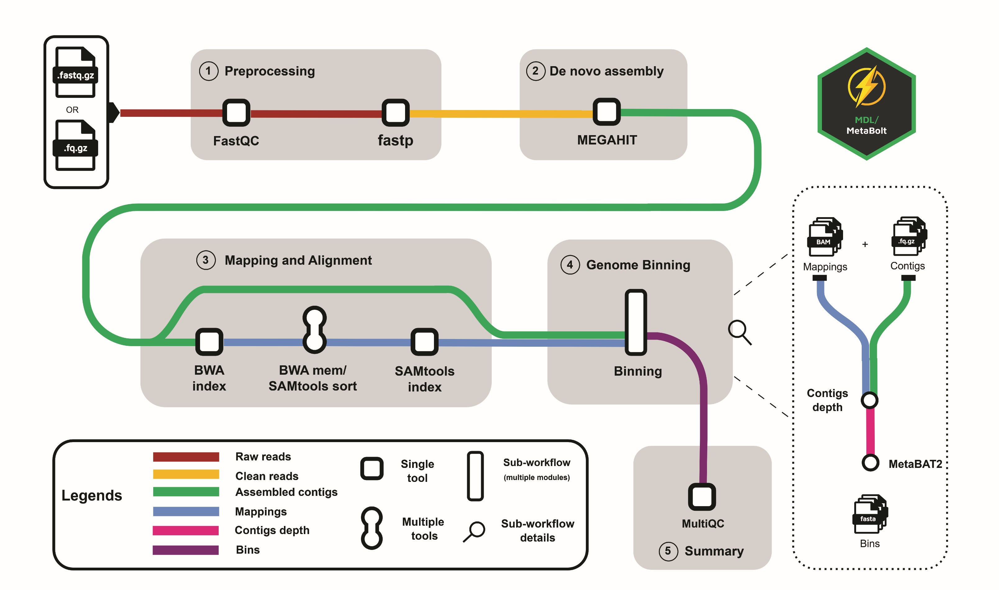

# MDL/MetaBolt

[](https://www.nextflow.io/)
[](https://github.com/muneebdev7/metabolt/actions/workflows/ci.yml)
[](https://github.com/muneebdev7/metabolt/actions/workflows/linting.yml)
[](https://www.nf-test.com)

[](https://docs.conda.io/en/latest/)
[](https://www.docker.com/)
[](https://sylabs.io/docs/)
[](https://cloud.seqera.io/launch?pipeline=https://github.com/muneebdev7/metabolt)


[](https://doi.org/10.5281/zenodo.15243430)

## Introduction

**MDL/MetaBolt** is a bioinformatics pipeline for efficient de novo metagenome assembly and binning.



1. Read QC ([`FastQC`](https://www.bioinformatics.babraham.ac.uk/projects/fastqc/))

2. Preprocessing ([`fastp`](https://github.com/OpenGene/fastp))

3. Assembly ([`MEGAHIT`](https://github.com/voutcn/megahit))

4. Alignment ([`BWA`](https://github.com/lh3/bwa))

   - **Indexing**
     Generates index files from reference genomes to expedite the alignment process.

   - **Mapping**
     Aligns sequencing reads to the indexed reference genome.

5. SAMtools ([`SAMtools`](https://github.com/samtools/samtools))
   Provides utilities for processing and managing SAM/BAM files.

   - **Sorting**
     Organizes alignments by genomic coordinates to facilitate efficient data retrieval.

   - **Indexing**
     Creates index files for sorted BAM files, enabling rapid access to specific genomic regions.

6. Contigs Depth Calculation ([`jgi_summarize_bam_contig_depth`](https://bitbucket.org/berkeleylab/metabat/src/master/))

7. Binning ([`MetaBAT2`](https://bitbucket.org/berkeleylab/metabat/src/master/))

8. Present QC for Raw Reads ([`MultiQC`](https://multiqc.info/))

## Usage

> [!NOTE]
> If you are new to Nextflow and nf-core, please refer to [this page](https://nf-co.re/docs/usage/installation) on how to set-up Nextflow. Make sure to [test your setup](https://nf-co.re/docs/usage/introduction#how-to-run-a-pipeline) with `-profile test` before running the workflow on actual data.

### Minimum Steps to Execute the Pipeline

1. **Samplesheet Preparation:**

   - Prepare a samplesheet with your input data. Each row represents a sample, with columns specifying the sample name and the paths to the FASTQ files.

   - Example `samplesheet.csv` (for paired-end reads):

     ```csv
     sample,fastq_1,fastq_2
     CONTROL,AEG588A1_S1_R1_001.fastq.gz,AEG588A1_S1_L002_R2_001.fastq.gz
     CONDITION,SRR123_S1_R1_011.fastq.gz,SRR123_S1_R2_011.fastq.gz
     ```

   > Each row represents a FASTQ file (single-end) or a pair of FASTQ files (paired-end).

2. **Run the pipeline:**

   ```bash
   nextflow run muneebdev7/metabolt \
     -profile <docker/singularity/conda/institute> \
     --input samplesheet.csv \
     --outdir <OUTDIR>
   ```

> [!WARNING]
> Please provide pipeline parameters via the CLI or Nextflow `-params-file` option. Custom config files including those provided by the `-c` Nextflow option can be used to provide any configuration _**except for parameters**_; see [docs](https://nf-co.re/docs/usage/getting_started/configuration#custom-configuration-files).

## Pipeline output

To see the results of an example test run with a full size dataset refer to the `results` directory.
For more details about the output files and reports, please refer to the
[`output documentation`](docs/output.md).

## Credits

MDL/metabolt was written by [Muhammad Muneeb Nasir](https://github.com/muneebdev7/metabolt) at [Metagenomics Discovery Lab (MDL)](https://sines.nust.edu.pk/) at SINES, NUST.

We thank the following people for their extensive assistance in the development of this pipeline:

- [Dr. Masood Ur Rehman Kayani](https://sines.nust.edu.pk/faculty/masood-ur-rehman-kayani/)
- [Hajra Qayyum](https://www.researchgate.net/profile/Hajra-Qayyum)
- [Haseeb Manzoor](https://www.linkedin.com/in/haseebmanzoor/)

## Contributions and Support

If you would like to contribute to this pipeline, please see the [`contributing guidelines`](.github/CONTRIBUTING.md).

For further information or help, don't hesitate to get in touch on [`email`](mailto:muneebgojra@gmail.com).

## Citations

<!-- If you use [muneebdev7/metabolt](https://www.github.com/muneebdev7/metabolt) for your analysis, please cite it using the following doi: [10.5281/zenodo.XXXXXX](https://doi.org/10.5281/zenodo.XXXXXX) -->

The strategy to use a reduced k-mer set for efficient assembly, employed in this pipeline, is based on the following preprint:

> **Efficient de novo metagenome assembly using reduced k-mer sets.**
>
> Hajra Qayyum, Masood Ur Rehman Kayani.
>
> _bioRxiv._ 2024 Jun 8. doi: [10.1101/2024.06.08.598064v2](https://www.biorxiv.org/content/10.1101/2024.06.08.598064v2).

An extensive list of references for the tools used by the pipeline can be found in the [`CITATIONS.md`](CITATIONS.md) file.

This pipeline uses code and infrastructure developed and maintained by the [nf-core](https://nf-co.re) community, reused here under the [MIT license](https://github.com/nf-core/tools/blob/main/LICENSE).

> **The nf-core framework for community-curated bioinformatics pipelines.**
>
> Philip Ewels, Alexander Peltzer, Sven Fillinger, Harshil Patel, Johannes Alneberg, Andreas Wilm, Maxime Ulysse Garcia, Paolo Di Tommaso & Sven Nahnsen.
>
> _Nat Biotechnol._ 2020 Feb 13. doi: [10.1038/s41587-020-0439-x](https://dx.doi.org/10.1038/s41587-020-0439-x).
